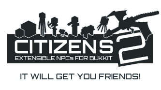
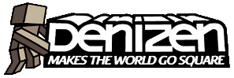
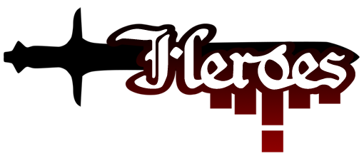
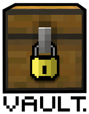

# Dependencies

Quests can link with many other plugins available on [Spigot](https://www.spigotmc.org/). Below is a list of every plugin that can be used, along with a description of how it links. Note that each plugin is entirely optional and are in no way required to use Quests.

| Labels:                                      |                                               |
| -------------------------------------------- | --------------------------------------------- |
| 🌟 = Recommended for optimal user experience | 💲 = May require purchase of premium resource |

### AstralBooks

↳ [Download](https://github.com/NicoNekoDev/AstralBooks)

***

### Citizens 🌟

↳ [Download](https://www.spigotmc.org/resources/citizens.13811/)

***

### Denizen

↳ [Download](https://www.spigotmc.org/resources/denizen.21039/)


**Note:** Try using [Depenizen](https://ci.citizensnpcs.co/job/Depenizen/) to perform Quests tasks.


***

### DungeonsXL

↳ [Download](https://www.spigotmc.org/resources/dungeonsxl.9488/)

***

### GPS 💲

↳ [Download](https://www.spigotmc.org/resources/gps-1-9-1-13-2-the-first-ever-minecraft-global-positioning-system.53672/) (requires [GPS-Quests](https://pikamug.gitbook.io/quests/casual/bridge-plugins#gps-quests))

***

### Heroes 💲



[Download](https://www.spigotmc.org/resources/%E2%9A%94-heroes-premium-%E2%9A%94.24734/) (premium)



[Download](https://www.spigotmc.org/resources/heroes-legacy.305/) (free)



***

### mcMMO Classic 💲

↳ [Download](https://www.spigotmc.org/resources/official-mcmmo-classic.2445/)


**Note:** For the premium mcMMO Overhaul, use [this module](https://pikamug.gitbook.io/quests/casual/modules#mcmmo-overhaul) instead.


***

### Parties 🌟

↳ [Download](https://www.spigotmc.org/resources/parties-an-advanced-parties-manager.3709/)

***

### PlaceholderAPI

↳ [Download](https://www.spigotmc.org/resources/placeholderapi.6245/)

***

### Unite

<figure><figcaption>
Support multiple party plugins.
</figcaption></figure>

↳ [Download](https://www.spigotmc.org/resources/unite.95217/)

***

### Vault

↳ [Download](https://www.spigotmc.org/resources/vault.34315/) (requires an economy plugin like [Fé](https://www.spigotmc.org/resources/fe.723/))

***

### WorldGuard

↳ [Download](https://dev.bukkit.org/projects/worldguard/files)

***

### ZNPCsPlus 🌟

<figure><figcaption>
Start and interact with quests through NPCs.
</figcaption></figure>

↳ [Download](https://www.spigotmc.org/resources/znpcsplus.109380/)

### WIP below this line ------------

<table data-view="cards"><thead><tr><th align="center"></th><th></th><th align="center"></th><th data-hidden data-card-cover data-type="files"></th></tr></thead><tbody><tr><td align="center"><strong>AstralBooks</strong></td><td><em>Open books from Citizens NPCs.</em></td><td align="center"><a href="https://github.com/NicoNekoDev/AstralBooks">Github</a></td><td><a href="../.gitbook/assets/icon_astralbooks.png">icon_astralbooks.png</a></td></tr><tr><td align="center"><strong>Citizens</strong> 🌟</td><td><em>Start and interact with quests through NPCs.</em></td><td align="center"><a href="https://www.spigotmc.org/resources/citizens.13811/">SpigotMC</a></td><td><a href="../.gitbook/assets/icon_citizens.png">icon_citizens.png</a></td></tr><tr><td align="center"><strong>Denizen</strong></td><td><em>Run scripts during quests. Try using</em> <a href="https://github.com/DenizenScript/Depenizen"><em>Depenizen</em></a> <em>to perform tasks.</em></td><td align="center"><a href="https://www.spigotmc.org/resources/denizen.21039/">SpigotMC</a></td><td><a href="../.gitbook/assets/icon_denizen.png">icon_denizen.png</a></td></tr><tr><td align="center"><strong>DungeonsXL</strong></td><td><em>Create and join groups to complete quests en masse.</em></td><td align="center"><a href="https://www.spigotmc.org/resources/dungeonsxl.9488/">SpigotMC</a></td><td></td></tr><tr><td align="center"><strong>GPS</strong> 💲</td><td><em>Version 2.3.6 or higher for arrow guides. Requires</em> <a href="https://www.spigotmc.org/resources/gps-quests.67835/"><em>GPS-Quests</em></a><em>.</em></td><td align="center"><a href="https://www.spigotmc.org/resources/gps-1-9-1-13-2-the-first-ever-minecraft-global-positioning-system.53672/">SpigotMC</a></td><td></td></tr><tr><td align="center"><strong>Heroes</strong> 💲</td><td><em>Give experience rewards or require class.</em></td><td align="center"><a href="https://www.spigotmc.org/resources/%E2%9A%94-heroes-premium-%E2%9A%94.24734/">Premium</a> | <a href="https://www.spigotmc.org/resources/heroes-legacy.305/">Free</a></td><td></td></tr><tr><td align="center"><strong>mcMMO Classic</strong> 💲</td><td><em>Reward or require skill levels.</em></td><td align="center"><a href="https://www.spigotmc.org/resources/official-mcmmo-classic.2445/">SpigotMC</a></td><td></td></tr><tr><td align="center"><strong>Parties</strong> 🌟</td><td><em>Create and join parties to complete quests en masse.</em></td><td align="center"><a href="https://www.spigotmc.org/resources/parties-an-advanced-parties-manager.3709/">SpigotMC</a></td><td></td></tr><tr><td align="center"><strong>PlaceholderAPI</strong></td><td><em>Use PAPI string variables in Quests language files.</em></td><td align="center"><a href="https://www.spigotmc.org/resources/placeholderapi.6245/">SpigotMC</a></td><td></td></tr><tr><td align="center"><strong>Unite</strong></td><td><em>Support multiple party plugins.</em></td><td align="center"><a href="https://www.spigotmc.org/resources/unite.95217/">SpigotMC</a></td><td></td></tr><tr><td align="center"><strong>Vault</strong></td><td><em>Reward or require in-game currency. Requires an economy plugin like</em> <a href="https://www.spigotmc.org/resources/fe.723/"><em>Fé</em></a><em>.</em></td><td align="center"><a href="https://www.spigotmc.org/resources/vault.34315/">SpigotMC</a></td><td></td></tr><tr><td align="center"><strong>WorldGuard</strong></td><td><em>Set regions for use with Quests.</em></td><td align="center"><a href="https://dev.bukkit.org/projects/worldguard">BukkitDev</a></td><td></td></tr><tr><td align="center"><strong>ZNPCsPlus</strong> 🌟</td><td><em>Start and interact with quests through NPCs.</em></td><td align="center"><a href="https://www.spigotmc.org/resources/znpcsplus.109380/">SpigotMC</a></td><td></td></tr></tbody></table>
