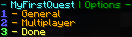

# Options

Une fois que vous vous êtes familiarisé avec l'[éditeur de quête](../setup/quests-editor.md), vous vous posez peut-être des questions sur la sélection « Modifier les options ». Ce sont des contrôles qui s'appliquent _par-quête_, et sont différents des paramètres de [config.yml](https://pikamug.gitbook.io/quests/v/french-francais/configuration/configuration#config.yml) qui eux sont appliqués à _toutes_ les quêtes.

### Général

| # | Choix                                                        | Description                                                               |
| - | ------------------------------------------------------------ | ------------------------------------------------------------------------- |
| 1 | Autoriser des commandes durant la quête                      | Si les joueurs peuvent utiliser des commandes après avoir pris la quête   |
| 2 | Autoriser l'abandon pendant la quête                         | Si les joueurs peuvent quitter la quête après l'avoir acceptée            |
| 3 | Ignorer les blocs cassés avec l'enchantement Toucher de soie | Si l'objectif de casser des blocs compte ceux cassés avec Toucher de soie |
| 4 | Ignorer les blocs remplacés une fois cassés                  | Si le placement de blocs décrément-nous les objectifs de casser des blocs |

### Multiplayer

| # | Choix                            | Description                                                                                                                             |
| - | -------------------------------- | --------------------------------------------------------------------------------------------------------------------------------------- |
| 1 | Définir le fournisseur via Unite | Définir l'intégration avec le plugin party via [Unite](https://pikamug.gitbook.io/quests/v/french-francais/debutant/dependencies#unite) |
| 2 | Utiliser le plugin Parties       | Basculer l'intégration avec [Parties](https://pikamug.gitbook.io/quests/v/french-francais/debutant/dependencies#parties)                |
| 3 | Niveau de partage de progression | Comment la progression de la quête est distribuée, voir ci-dessous                                                                      |
| 4 | Partager qu'avec la même quête   | Si les joueurs doivent avoir la même quête pour partager leurs progrès                                                                  |
| 5 | Rayon de distance maximum        | Distance maximal entre les joueurs pour que le partage de progression compte                                                            |
| 6 | Inclus les joueurs hors-ligne    | Si le partage comprend les joueurs hors ligne                                                                                           |

Pour le niveau de partage des progrès, les différentes valeurs fonctionnent comme décrites ci dessous:

1. Tout (default): Partager constament la progression. Si un joueur casse un bloc, tous les joueurs cassent un bloc.
2. Objectifs: Si un joueur complète un objectifs (casser 50 blocs de terres), tous les membres termineront l'objectif.
3. Etapes: Si un joueur finis une étape, tous les membres passeront à la suivante.
4. Quêtes: similaire à la fonctionnalité des anciennes versions. Tous les membres la finissent quand l'un termine complètement une quête.
