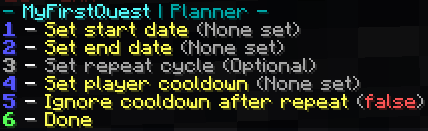

# Planner

Once you've familiarized yourself with the [Quest Editor](../setup/quests-editor.md), you may be wondering about the 'Edit Planner' selection. This sub-menu contains controls for when your quest should be available, based on real time:



<details>

<summary>Expand to see the breakdown.</summary>

1. Time the quest should become available
2. Time the quest should cease to be available
3. Length until quest is available again
4. Length to wait after completing quest
5. If true, players can take quest immediately after repeat cycle ends
6. Finish working on your quest planner

</details>

To better understand these selections, examples are provided below.

**Daily Quest**

In the real world, most businesses are only open during peak shopping hours. Similarly, you may wish to only have your quest available at certain times each day. The following is how such a quest might appear in quests.yml:

```
custom1:
    name: OnceDaily
    ...
    planner:
      start: 11:0:2020:9:0:0:SystemV/EST5  # Month is zero-based; 0 = January
      end: 11:0:2020:17:0:0:SystemV/EST5  # Month is zero-based; 0 = January
      repeat: 86400
      cooldown: 32400
      override: true
```

The **start date** is set to January 11, 2020 at 9:00 AM EST. The **end date** is set to January 11, 2020 at 5:00 PM EST. This means that the quest will only be available for eight hours.

Since we want players to be able to take the quest every day, the **repeat cycle** is set to 86400 seconds (24 hours). This wait time is based on the start date, so the quest will next become available on January 12, 2020, then again on the 13th, and so on. Just like the original duration, it will still only be available between 9:00 AM and 5:00 PM daily.

Lastly, we set a **player cooldown** of 32400 seconds (9 hours) because we do not want the player to take our quest a second time if they complete it before 5:00 PM. This ensures even the fastest players won't be able to take the quest again until the next day. If you want players to be able to take the quest at 9:00 AM the next day regardless of whether their cooldown has expired, you may set the **ignore cooldown after repeat** override to _true_.

**New Years' Celebration**

Let's create a quest for a New Years' party. Please observe the following example as it would appear in quests.yml:

```
custom1:
    name: PrepareForNewYears
    ...
    planner:
      start: 31:11:2020:23:0:0:SystemV/EST5  # Month is zero-based; 0 = January
      end: 1:0:2021:0:0:0:SystemV/EST5  # Month is zero-based; 0 = January
      repeat: 31536000
      cooldown: 3600
      override: false
```

The **start date** is set to December 31, 2020 at 11:00 PM EST. The **end date** is set to January 1, 2021 at midnight. This means that the quest will only be available for one hour.

Since we want to celebrate _every year_, the **repeat cycle** is set to 31536000 seconds (one calendar year). This wait time is based on the start date, so the quest will next become available on December 31, 2021, then again on the 31st of 2022, and so on. It will only be available for one hour, just like the original duration.

Lastly, we set a **player cooldown** of 3600 seconds (one hour) because we do not want the player to take our quest a second time if they complete it within one hour. This ensures even the quickest players won't be able to take the quest again until next year.
