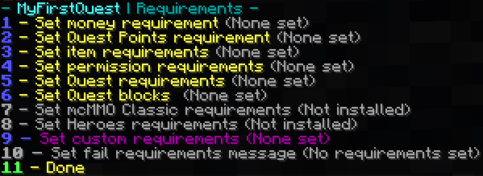

# Изисквания

След като се запознаете с [Редактора на задачи](../setup/quests-editor.md), може би се чудите за избора 'Промени Изисквания'. Това подменю съдържа предпоставки, които вашия играч трябва да има, преди да приеме задача:

Разгънете за да видите разбивката.

1. Необходими са пари чрез [Vault](https://pikamug.gitbook.io/quests/beginner/dependencies#vault)
2. Нужни са точки
3. Нужен е предмет като смарагди или диаманти
4. Нужен е ванила опит
5. Нужно е разрешение
6. Задачи които трябва да бъдат изпълнени преди тази
7. Задачи, които предотвратяват приеманието на тази
8. Нужни са [mcMMO Classic](https://pikamug.gitbook.io/quests/beginner/dependencies#mcmmo-classic) нива
9. Нужни са [Heroes](https://pikamug.gitbook.io/quests/beginner/dependencies#heroes) нива
10. Изисквания от [Персонализиран модул](../casual/modules.md)
11. Персонализирано съобщение, показано на играча, описващо неговите изисквания
12. Завършете работата по изискванията на тази задача

Имайте предвид, че безпланият McMMO Classic e различен от платения McMMO Overhaul, който не се поддържа първоначално. За да използвате Quests с McMMO Overhaul, ще ви трябва [персонализиран модул](https://pikamug.gitbook.io/quests/casual/modules#mcmmo-overhaul) който се използва чрез персонализирани изисквания.
