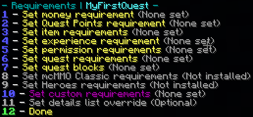

# 要求

在您熟悉了[任务编辑器](../setup/quests-editor.md)之后，您可能会好奇“编辑要求”这个选项。这个子菜单包含玩家在接受任务之前需要满足的前置条件：

展开查看详细说明。

1. 通过 [Vault](https://pikamug.gitbook.io/quests/beginner/dependencies#vault) 所需的金钱
2. 所需的任务点数
3. 所需的材料，例如绿宝石或钻石
4. 所需的原版经验值
5. 所需的玩家权限
6. 必须先接受的任务
7. 会阻止接受当前任务的任务
8. 所需的 [mcMMO Classic](https://pikamug.gitbook.io/quests/beginner/dependencies#mcmmo-classic) 经验等级
9. 所需的 [Heroes](https://pikamug.gitbook.io/quests/beginner/dependencies#heroes) 经验等级
10. 来自 [Quests 模块](../casual/modules.md) 的要求
11. 覆盖显示给玩家的要求描述消息
12. 完成任务要求的编辑

请注意，免费的 mcMMO Classic 与付费的 mcMMO Overhaul 不同，后者不原生支持。要将 Quests 与 mcMMO Overhaul 一起使用，您需要[对应的模块](https://pikamug.gitbook.io/quests/casual/modules#mcmmo-overhaul)，该模块会在自定义要求下加载。