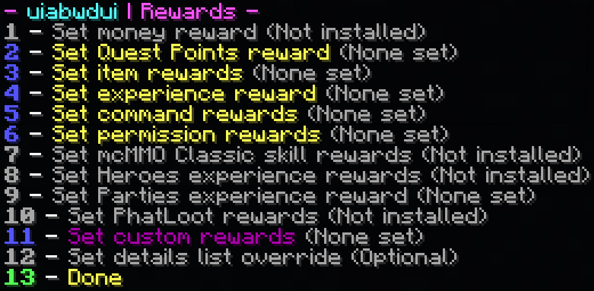

# Награди

След като се запознаете с [Редактора на задачи](../setup/quests-editor.md), може би се чудите за избора 'Промени наградите'. Това подменю съдържа награди, които вашият играч ще получи при завършване на задачата.

Разгънете за да видите разбивката..

1. Парична награда чрез [Vault](https://pikamug.gitbook.io/quests/beginner/dependencies#vault)
2. Точки за използване като изискване за задача
3. Предметна награда като Смадагди и Диаманти
4. Награда ванила опит
5. Изпълнете команда от конзолата (`<player>` замества името)
6. Дайте разрешение на играча от конзолата чрез Vault
7. [mcMMO Classic](https://pikamug.gitbook.io/quests/beginner/dependencies#mcmmo-classic) награда за опит и нива
8. [Heroes](https://pikamug.gitbook.io/quests/beginner/dependencies#heroes) награда за нива
9. [Parties](https://pikamug.gitbook.io/quests/beginner/dependencies#parties) награда за нива
10. Награда от [Персонализиран модул](https://pikamug.gitbook.io/quests/casual/modules)
11. Персонализирано съобщение, показано на играча, описващо неговите награди.
12. Завършете работата по наградите си за задачата

Имайте предвид, че безпланият McMMO Classic е различен от платения McMMO Overhaul, който не сеп поддържа първоначално. За да използвате Quests с McMMO Overhaul, ще ви трябва [персонализиран модул](https://pikamug.gitbook.io/quests/casual/modules#mcmmo-overhaul) който се използва под персонализирани награди.
