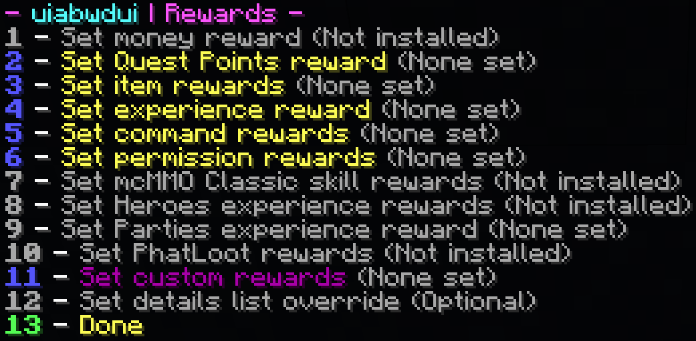

# 奖励

在您熟悉了[任务编辑器](../setup/quests-editor.md)之后，您可能会好奇“编辑奖励”这个选项。这个子菜单包含玩家完成任务后将获得的奖励：

展开查看详细说明。

1. 通过 [Vault](https://pikamug.gitbook.io/quests/beginner/dependencies#vault) 给予的金钱奖励
2. 可用于任务前提条件的积分
3. 材料奖励，例如绿宝石或钻石
4. 原版经验等级奖励
5. 从控制台执行命令（`<player>` 将被替换为玩家名称）
6. 通过 Vault 从控制台给予玩家权限
7. [mcMMO Classic](https://pikamug.gitbook.io/quests/beginner/dependencies#mcmmo-classic) 经验等级奖励
8. [Heroes](https://pikamug.gitbook.io/quests/beginner/dependencies#heroes) 经验等级奖励
9. [Parties](https://pikamug.gitbook.io/quests/beginner/dependencies#parties) 经验等级奖励
10. 来自 [Quests 模块](https://pikamug.gitbook.io/quests/casual/modules) 的奖励
11. 覆盖显示给玩家描述其奖励的消息
12. 完成任务奖励的编辑

请注意，免费的 mcMMO Classic 与付费的 mcMMO Overhaul 不同，后者不原生支持。要将 Quests 与 mcMMO Overhaul 一起使用，您需要[该模块](https://pikamug.gitbook.io/quests/casual/modules#mcmmo-overhaul)，它会在自定义奖励下加载。