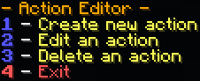
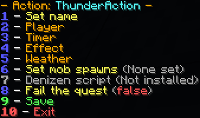
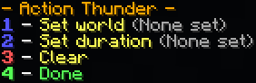
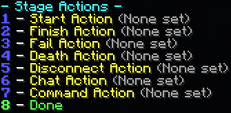

# 动作编辑器

类似于所有任务阶段都有目标一样，它们也可以执行动作。动作是指在阶段过程中发生的事情，但通常属于装饰性，不会直接推进任务进度。例如，让玩家损失饥饿值或被闪电击中就被视为动作。

要创建动作，请在游戏中（或从控制台，有限功能）运行 **/quests actions**。您会看到以下界面：

在聊天中输入 '1'，插件会提示您为动作输入一个名称。这个名称可以是任意字母数字序列（允许字母和数字，但不允许特殊字符或符号）！如果不确定，没关系，您稍后可以修改。

选择一个有效名称后，会出现以下界面：

展开查看详细说明。

1. 修改动作的名称
2. 发送消息、清空背包、给予物品、施加药水效果、设置饥饿值、设置饱和度、传送至指定位置，或执行命令
3. 设置任务失败的延迟时间，以及是否取消任务计时器
4. 设置粒子效果或爆炸位置
5. 在特定世界设置风暴或雷雨，或设置闪电打击位置
6. 生成生物的动作
7. 运行 [Denizen](https://pikamug.gitbook.io/quests/beginner/dependencies#denizen) 脚本
8. 使任务失败的动作
9. 完成动作的编辑
10. 放弃对动作的所有修改

现在，输入 '5' 进入天气菜单，然后输入 '2' 来设置一个在世界中强制雷雨持续一段时间的动作。

输入 '1' 来按名称选择 Minecraft 服务器中的一个世界。世界列表会方便地显示出来，但您一次只能选择一个！如果需要对多个世界施加雷雨，您可以稍后创建第二个动作。

完成后，输入 '2' 来设置雷雨持续的秒数。例如，输入 180 即可让事件持续 3 分钟。现在，继续输入相应的 'Done' 选项数字，直到保存动作。

干得漂亮！与 [任务编辑器](../setup/quests-editor.md) 不同，这里无需重新加载插件。退出动作编辑器，然后在任务编辑器中创建或编辑一个任务。进入“编辑阶段”菜单，在设置至少一个目标后，选择选项 9 来运行动作（可在阶段开始时、进行中或结束时触发）：

展开查看详细说明。

1. 在阶段开始时激活
2. 在阶段结束时激活
3. 如果玩家任务失败时激活
4. 如果玩家在阶段中死亡时激活
5. 如果玩家在阶段中断开连接时激活
6. 如果玩家在阶段中发送聊天消息时激活
7. 如果玩家在阶段中执行命令时激活
8. 保存并返回上一菜单

聊天和命令动作会在阶段进行中，当玩家在游戏中输入特定关键词或命令时分别触发。