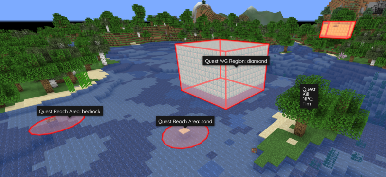

# Bridge Plugins


**Notice:** This information is intended for intermediate users. Read carefully!


Plenty of other server plugins natively depend on Quests. However, it is sometimes easier or more beneficial for a developer to make an "in-between" plugin to link their resource to Quests. Unlike [modules](modules.md), bridge plugins handle more than just objectives or rewards. Below is a list of published examples.

| Labels:                                      |                                               |
| -------------------------------------------- | --------------------------------------------- |
| 🌟 = Recommended for optimal user experience | 💲 = May require purchase of premium resource |

### BlueMap-Quests 💲

↳ [Download](https://www.spigotmc.org/resources/bluemap-quests.96806/)

### Depenizen

<figure><figcaption>
Utilize Quests commands, events, and properties in Denizen scripts.
</figcaption></figure>

↳ [Download](https://github.com/DenizenScript/Depenizen)

### Dynmap-Quests 💲

↳ [Download](https://www.spigotmc.org/resources/dynmap-quests.65987/)

### GPS-Quests 💲

↳ [Download](https://www.spigotmc.org/resources/gps-quests.67835/)

### QuestsBar 💲

↳ [Download](https://www.spigotmc.org/resources/questsbar.100634/)

### QuestsGUI 🌟💲

↳ [Download](https://www.spigotmc.org/resources/questsgui.71666/)
