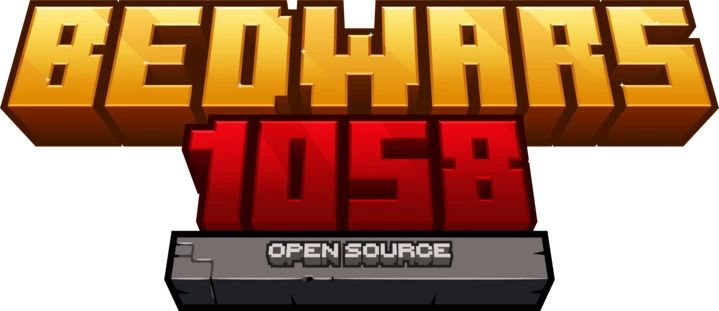
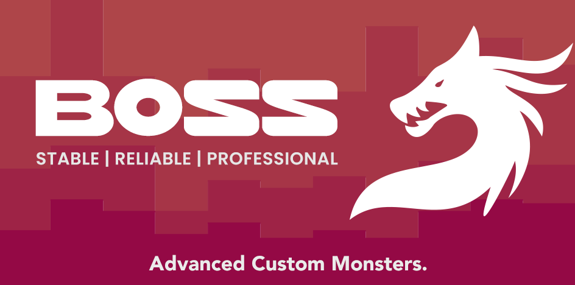
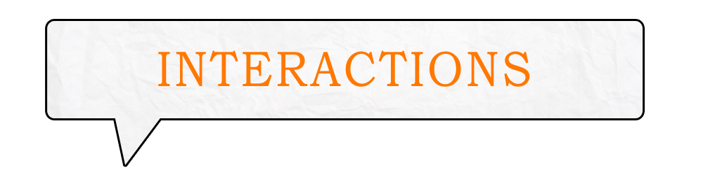
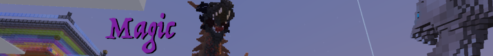
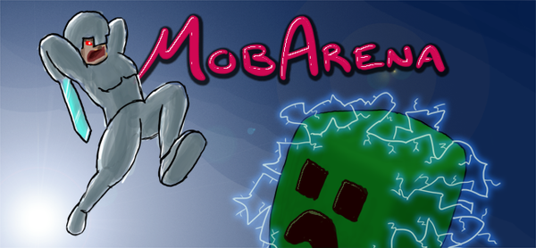
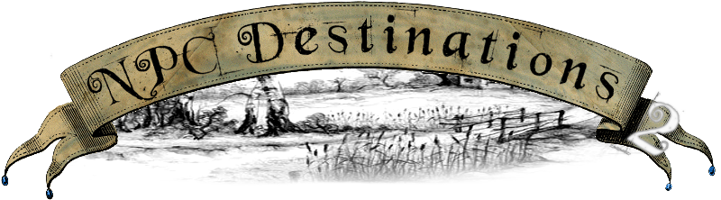

# Модули


**Забележка:** Тази информация е предназначена за средно напреднали потребители. Прочети внимателно!


Плъгините, които се интегрират с Quests, за да предоставят персонализирани цели, награди и изисквания, използват това, което е известно като _модули_. Модулут е jar файл, създаден от разработчици, използващи [Quests API](../master/custom-quest-api.md), който действа като посредник между Quests и интегриращия плъгин. Това е в контраст с [зависимости](../beginner/dependencies.md), за което обикновено не се нуждаете от модул.

Модул файловете трябва да бъдат поставени в папка _Quests/modules_ докато целевият плъгин отива в папката _/plugins_ както обикновено. Имайте предвид, че всички модули са изцяло незадължителни и можете да ги добавяте или премахване, както сметнете за добре. По-долу е даден непълен списък с популярни плъгини, за които е известно, че съществува модул, заедно с описание на това как се свързва.

| Етикети:                                               |                                                   |
| ------------------------------------------------------ | ------------------------------------------------- |
| 🌟 = Препоръчва се за оптимално потребилско изживяване | 💲 = Може да изисква закупуване на премиум ресурс |

### BedWars1058 💲

↳ [Изтегляне](https://www.spigotmc.org/resources/bedwars1058-quests-module.100722/)

### Boss 💲

↳ [Изтегляне](https://www.spigotmc.org/resources/boss-quests-module.66973/) (Изисква Quests 3.6.0 или по нов)

### CustomMobs



[Изтегляне](https://www.spigotmc.org/resources/custommobs-quests-module.56686/)



[Изтегляне](https://www.spigotmc.org/resources/custommobs-quests-module.56686/download?version=232903)



[Изтегляне](https://www.spigotmc.org/resources/custommobs-quests.25679/)



### DungeonsXL

↳ [Изтегляне](https://www.spigotmc.org/resources/dungeonsxl-quests-module.66703/) (изисква Quests 3.6.0 или по нов)

### Interactions 💲

↳ [Изтегляне](https://www.spigotmc.org/resources/interactions-quests-module.92421/)

### Magic



[Изтегляне](http://jenkins.elmakers.com/job/MagicQuests/)



[Изтегляне](https://jenkins.elmakers.com/job/MagicQuests/90/)



[Изтегляне](https://jenkins.elmakers.com/job/MagicQuests/88/)



### Marcely's Bedwars 💲

<figure><figcaption>
Добавя "Start arena", "Open shop", "Buy item", "Buy upgrade", "Destroy bed", "Kill player", и "End arena" цели.
</figcaption></figure>

↳ [Изтегляне](https://www.spigotmc.org/resources/marcelys-bedwars-quests-module.107857/)

### mcMMO Overhaul 💲

↳ [Изтегляне](https://www.spigotmc.org/resources/92962/) (изисква Quests 4.0.0 или по нов)


**Забележка:** за по стари версии на mcMMO Classic, използвайте вместо това [тази зависимост](https://pikamug.gitbook.io/quests/beginner/dependencies#mcmmo-classic).


### MobArena

↳ [Изтегляне](https://www.spigotmc.org/resources/mobarena-quests-module.72355/) (изисква Quests 3.6.0 или по нов)

### MythicMobs 🌟💲



[Изтегляне](https://lectern.browsit.org/resources/resource/48-mythicmobs-quests-module/)



[Изтегляне](https://lectern.browsit.org/resources/resource/32-kill-mythic-mobs-multiplayer-improvement/)



[Изтегляне](https://mc.hackerzlair.org/jenkins/job/MythicMobsQuests/)



[Изтегляне](https://github.com/BerndiVader/MythicMobsQuestsModule/blob/a346d24545e874587c0895b30b369492978f6f81/MythicMobsQuests.jar)



[Изтегляне](https://github.com/BerndiVader/MythicMobsQuestsModule/blob/edd5df5968628c06e5670c0e2a1c19ca41a86467/MythicMobsQuests285.jar)



### NPCDestinations



[Изтегляне](https://www.spigotmc.org/resources/101588/)



Модула се инсталира автоматично от NPCDestinations.



### PhatLoots

↳ [Изтегляне](https://www.spigotmc.org/resources/phatloots-quests-module.102525/)

### Proskillapi

<figure><figcaption>
Добавя изисквания за клас и награди.
</figcaption></figure>

↳ [Изтегляне](https://www.spigotmc.org/resources/91913/) (модулът се инсталира автоматично от Proskillapi)

### Screaming BedWars 💲

↳ [Изтегляне](https://www.spigotmc.org/resources/screaming-bedwars-module.98380/)

### Искате поддръжка за други добавки или функции?

Ако не можете да намерите модул за определена цел тук или чрез търсене в Интернет, помислете за наемане на програмист в един от тези сайтове:

* [Quests Community](https://discordapp.com/invite/QdJAv2G7qg)
* [SpigotMC](https://www.spigotmc.org/forums/hiring-developers.55/)
* [Lectern](https://lectern.browsit.org/forum/view/6-services/)

Нито Quests, нито неговите сътрудници носят никаква отговорност за качеството и/или фукционалността на модуле на трети страни, подразбиращи се или по друг начин, независимо от произхода.
