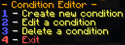

# 条件编辑器

当玩家正在执行任务的某个阶段时，可能需要强制要求他们满足特定条件。例如，在完成目标时必须手持特定物品。要实现这一点，需要创建并应用一个条件。

要创建条件，请在游戏中（或从控制台，有限功能）运行 **/quests conditions** 命令。您会看到以下界面：

在聊天栏输入 '1'，插件会提示您为条件输入一个名称。名称可以是任意字母数字序列（允许字母和数字，但不允许特殊字符或符号）！如果不确定，没关系，您稍后可以修改。

选择一个有效的名称后，将出现以下界面：

展开查看详细说明。

1. 修改条件的名称
2. 骑乘实体或 [Citizens](https://pikamug.gitbook.io/quests/beginner/dependencies#citizens) NPC
3. 拥有特定权限、手持主手中物品，或穿戴盔甲物品
4. 停留在指定世界、指定刻数内、指定生物群系内，或 [WorldGuard](https://pikamug.gitbook.io/quests/beginner/dependencies#worldguard) 区域内
5. 占位符值是否为 true
6. 如果条件未满足，是否使任务失败
7. 完成条件的编辑
8. 丢弃所有对该条件的修改

选择一种条件类型，并决定如果玩家未满足该条件是否应使任务失败。现在，继续输入相应提示数字，直到选择“完成”并保存您的条件。

做得好！与任务编辑器不同，这里无需重载插件。退出条件编辑器后，在任务编辑器中创建或编辑一个任务。进入“编辑阶段”菜单，在设置至少一个目标后，选择选项 11 来应用该条件。