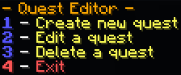
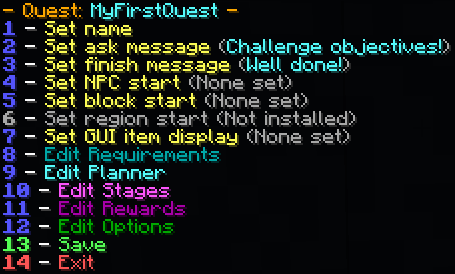
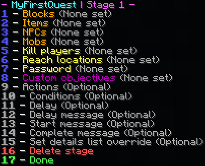
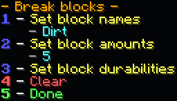

# 任务编辑器

让我们创建一个任务！默认情况下,任务编辑器仅对服务器管理员(op)可用。然而,在设置了[正确的权限](https://pikamug.gitbook.io/quests/setup/commands-and-permissions)后,只需在游戏中运行 **/quests editor** (或在控制台中运行,但功能有限)即可使用。您将看到以下界面:

在聊天框中输入 '1',插件会提示您为任务输入一个名称。这可以是任何字母数字序列,意味着字母和数字都可以,但不能包含特殊字符或符号!别担心,如果您不确定,以后可以修改。

选择有效名称后,将出现以下界面:

展开查看详细说明。

1. 更改任务名称
2. 玩家接受任务时显示
3. 玩家完成任务后显示
4. 必须与此 [Citizens](https://pikamug.gitbook.io/quests/beginner/dependencies#citizens) 或 [ZNPCsPlus](https://pikamug.gitbook.io/quests/beginner/dependencies#znpcsplus) NPC对话才能开始任务
5. 必须右键点击此方块才能开始任务
6. 必须在此 [WorldGuard](https://pikamug.gitbook.io/quests/beginner/dependencies#worldguard)区域内才能开始任务
7. 使用NPC GUI而不是聊天来开始任务
8. 更改玩家接受任务需要满足的条件
9. 更改任务可用的时段
10. 更改任务包含的目标
11. 更改玩家接受任务后获得的奖励
12. 更改专门针对您的任务的设置
13. 完成任务的编辑
14. 放弃任务的所有工作

选择真多!输入 '2',然后输入您希望玩家在任务中听到的第一条消息。完成后,输入 '3' 输入任务完成后的最终消息。


**专业提示:** 如果您安装了用于NPC的 [Citizens 2](https://www.spigotmc.org/resources/citizens.13811/) 或 [ZNPCsPlus](https://www.spigotmc.org/resources/znpcsplus.109380/),可以输入 '4' 选择一个您希望分发任务的NPC。


做得好!现在,如果您尝试保存任务,会得到一个错误。这是因为所有任务必须至少包含一个阶段。所以,让我们创建一个!输入 '11' 开始,然后输入 '1' 添加第一个阶段。

展开查看详细说明。

1. 包含破坏、放置、损坏或使用方块的目标
2. 包含制作、熔炼、附魔、酿造或消耗物品的目标
3. 包含向NPC交付物品、与NPC对话或杀死NPC的目标
4. 包含杀死或驯服生物、钓鱼或剪羊毛的目标
5. 杀死一定数量玩家的目标
6. 移动到世界坐标特定半径范围内的目标
7. 在聊天中输入特定字符串的目标
8. 来自已安装[自定义模块](../casual/modules.md)的目标
9. 设置至少一个目标后,在阶段开始、结束或期间运行[动作](../casual/action-editor.md)
10. 设置至少一个目标后,在阶段期间检查[条件](../expert/condition-editor.md)
11. 下一阶段开始前等待的秒数
12. 设置延迟后,延迟开始时向玩家显示消息
13. 阶段开始时向玩家显示消息
14. 阶段结束时向玩家显示消息
15. 覆盖向玩家显示的关于其目标的消息(使用 `<count>` 或 `%count%` 插入目标进度)
16. 永久删除此阶段
17. 完成阶段的编辑

见证任务的魔力!有如此多种不同的目标可供选择,可能性似乎是无穷无尽的!让我们尝试一个破坏方块的基本任务。输入 '1' 继续到方块菜单,然后再次输入 '1' 选择破坏方块。

在这里,您可以输入您希望玩家破坏的任何方块。泥土是一个容易的挑战,所以让玩家破坏五个吧。如果您使用的Minecraft版本_早于_1.13,您还可以设置耐久度以使用方块变体(例如,值为 '3' 将对应灰化土而不是泥土)。较新版本可以通过此字段指定作物的年龄(如小麦)。


**专业提示:** 玩家可以使用带有精准采集附魔的镐破坏方块而不影响任务。此功能可以在[选项](../beginner/options.md)中禁用。


输入 '完成' 的所有相应提示编号,直到返回到询问/完成消息界面。您即将完成!输入 '13',然后输入 '1' 保存您的任务。

干得好!要尝试您的新任务,可以运行 **/questadmin reload** 或重启服务器(请_不要_使用/reload),然后运行 **/quests take \[yourQuestName]**。一旦您制作了更多任务,您应该在[我们的Discord](https://discordapp.com/invite/d56CQ6e)上分享您最有趣的任务线。玩得开心!


**专业提示:** 自定义目标来自经常与其他插件链接的特殊附加组件,可在[这里](https://pikamug.gitbook.io/quests/casual/modules)找到。要使用一个,必须在启动时将其安装在您的/Quests/modules文件夹中。


